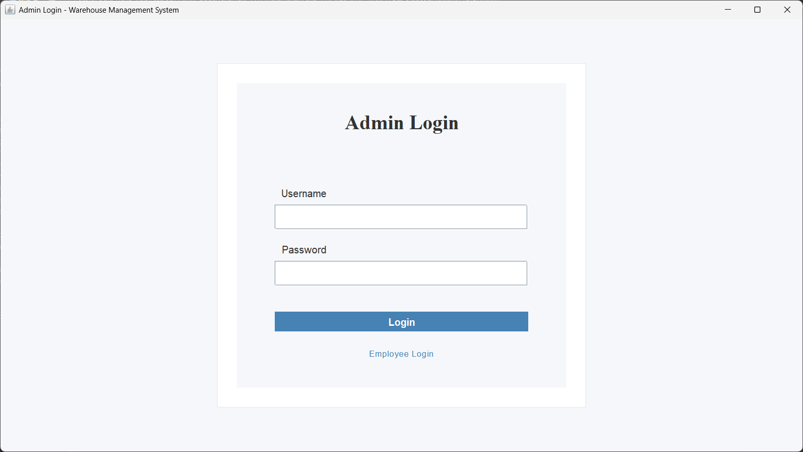
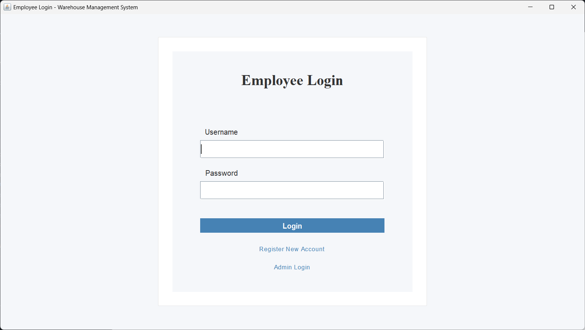
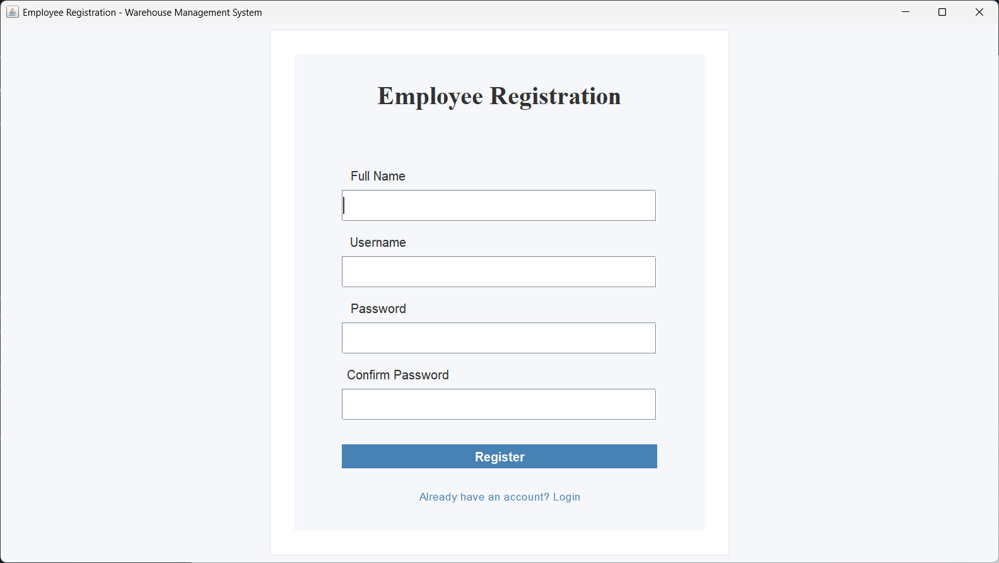
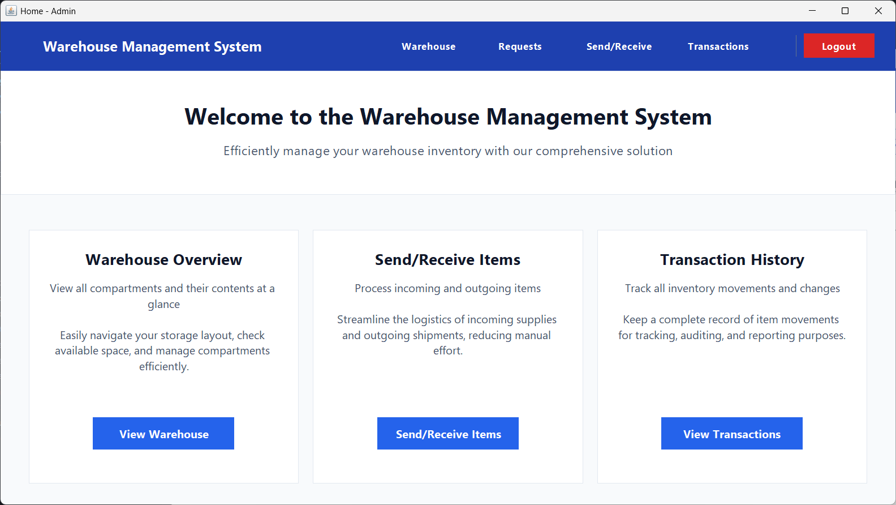
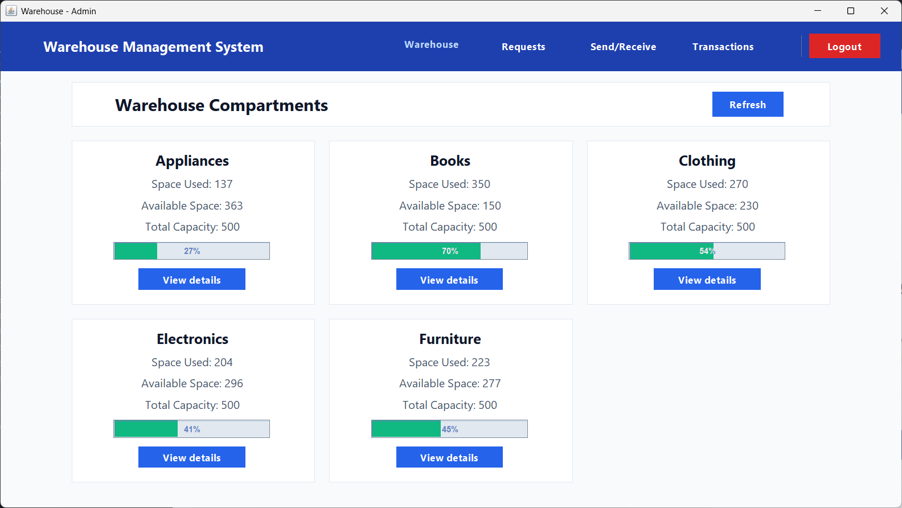
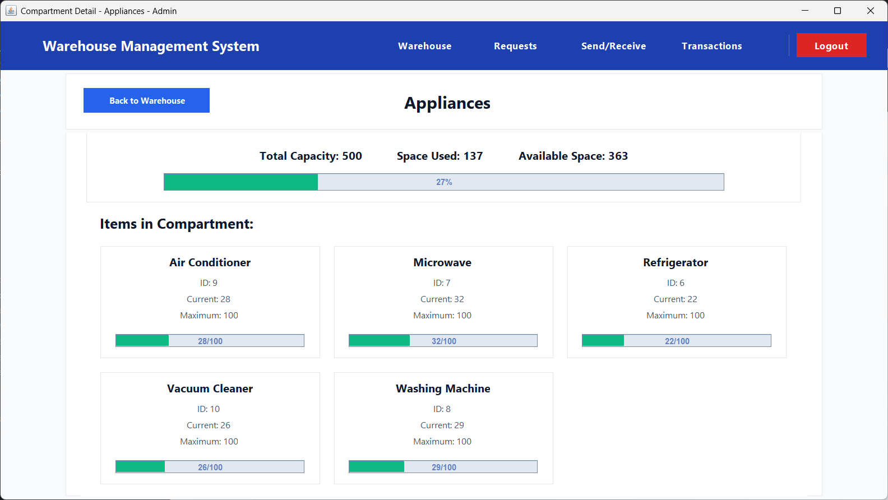
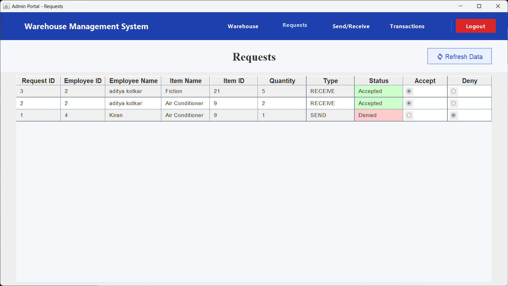
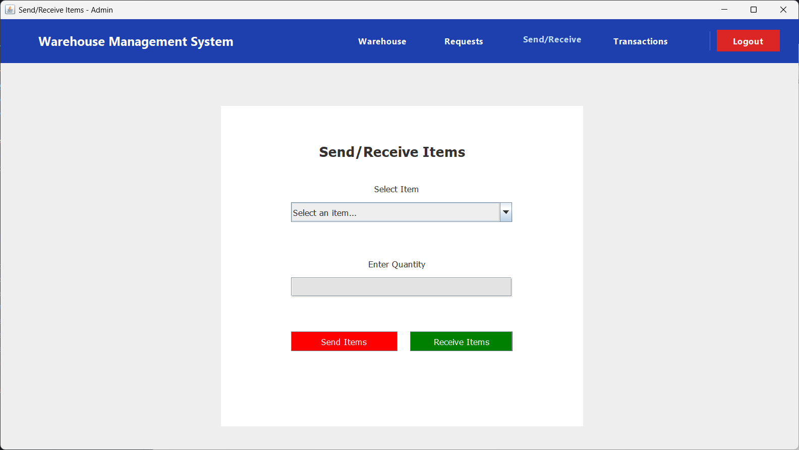
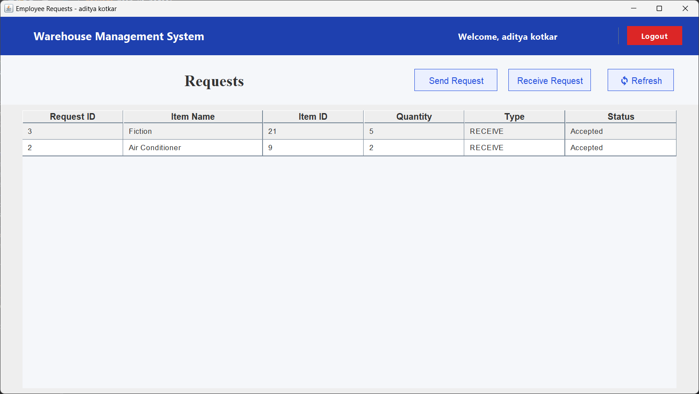
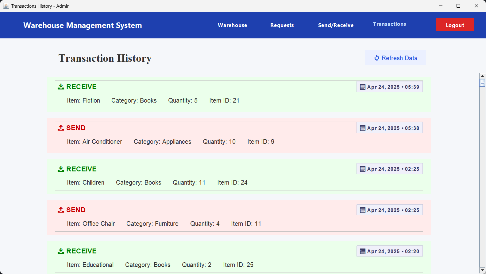

# Warehouse Management System

A Java desktop application for warehouse inventory management, built with Swing and JDBC.

## About This Project

This project is an enhanced version of [java_mini_proj](https://github.com/devinxhacker/java_mini_proj), which was originally a Java Swing recreation of the frontend from the [DBMS-Warehouse-System](https://github.com/RishiWaghmare12/DBMS-Warehouse-System) project.

While the original mini project had only 5 pages and relied on a Node.js backend server for API calls, this major project has been completely redesigned to:
1. Use JDBC for direct database connectivity (no external API server required)
2. Add user authentication with admin and employee roles
3. Implement a request approval system
4. Include additional pages and functionality

## Features

- User authentication with separate admin and employee portals
- Warehouse overview with categories and items
- Send/receive items functionality with approval workflow
- Transaction history with improved UI
- Space utilization tracking
- Employee request management
- Direct database connectivity via JDBC

## Screenshots

### Admin Login


### Employee Login


### Employee Registration


### Home Page


### Warehouse Overview


### Compartment Detail


### Admin Portal (Request Management)


### Admin Send/Receive Items


### Employee Requests


### Transactions History


## Requirements

- Java 21 or higher
- PostgreSQL database (connection is pre-configured)

## Quick Start

### Option 1: Download Released JAR

1. Download from [Releases](https://github.com/devinxhacker/java_major_proj/releases)
2. Run: `java -jar warehouse-management-system.jar`

### Option 2: Build from Source

1. Clone the repository:
   ```
   git clone https://github.com/devinxhacker/java_major_proj.git
   ```
2. Navigate to the project:
   ```
   cd java_major_proj
   ```
3. Build with Maven:
   ```
   mvn clean install
   ```
4. Run the JAR:
   ```
   java -jar .\target\warehouse-management-system.jar
   ```

### Option 3: Run from Source Code

1. Clone the repository:
   ```
   git clone https://github.com/devinxhacker/java_major_proj.git
   ```
2. Navigate to the project:
   ```
   cd java_major_proj
   ```
3. Run Home.java directly:
   - Open in your favorite IDE
   - Run the main method in `src/main/ui/pages/EmployeeLogin.java` (entry point)
   - Or compile and run from command line:
     ```
     javac -d bin src/main/ui/pages/EmployeeLogin.java
     java -cp bin main.ui.pages.EmployeeLogin
     ```